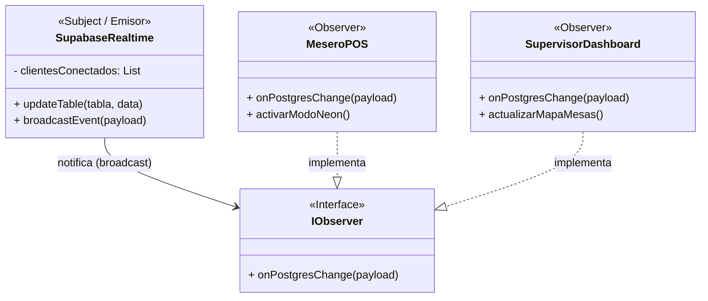
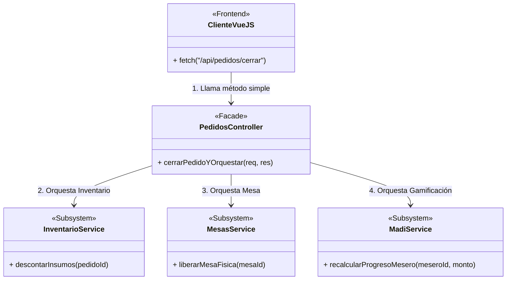
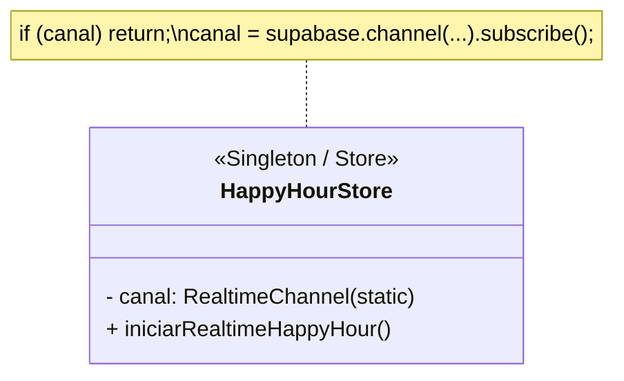

# Análisis de Arquitectura: Implementación de Principios SOLID y Patrones de Diseño

El presente documento analiza la estructura final del proyecto **AromaGrano System** (desarrollado con una arquitectura híbrida MVC + BaaS) y detalla la **implementación exitosa** de las mejores prácticas, principios SOLID y Patrones de Diseño de Software exigidos por la rúbrica del proyecto.

---

## 1. Principios SOLID Aplicados

### A. Principio de Responsabilidad Única (SRP - Single Responsibility Principle)
**Implementación:** El sistema ha sido desacoplado de manera que cada módulo tiene una única razón para cambiar.
*   **Capa de Presentación (Vue.js):** Archivos como `MeseroPOS.vue` o `SupervisorDashboard.vue` se encargan estrictamente de renderizar la interfaz de usuario y reaccionar a los clics.
*   **Capa de Estado (Pinia):** Archivos como `happyHourStore.js` aíslan y manejan globalmente variables como el estado del MADI.
*   **Capa de Servicios:** Archivos como `pedidosService.js` abstraen por completo el consumo de la API REST. El componente visual no sabe cómo se comunica con la base de datos, solo llama a la función de servicio.

### B. Separación de Intereses (SoC - Separation of Concerns)
**Implementación:** En el backend desarrollado en Node.js, la lógica no se programó en un solo archivo masivo. La aplicación está dividida en:
*   `routes`: Definen únicamente los endpoints (ej. `/api/pedidos`).
*   `controllers`: Reciben la petición HTTP, validan y devuelven respuestas JSON.
*   `services`: Ejecutan la lógica pesada transaccional y se conectan a la base de datos (PostgreSQL).

---

## 2. Patrones de Diseño Implementados

### 2.1. Patrón Observer (Observador) mediante WebSockets
**Justificación:** El sistema requiere que múltiples usuarios (Meseros, Supervisores) estén sincronizados en tiempo real sin recargar la página.
**Implementación:** Se utilizó **Supabase Realtime**, el cual es una implementación nativa del patrón Observer. 
*   **El Sujeto (Subject):** Es la base de datos PostgreSQL. Cuando el backend actualiza una tabla (ej. `configuracion_happy_hour` o `mesas`), el motor emite un evento de cambio (broadcast).
*   **Los Observadores (Observers):** Son los clientes Vue.js conectados (ej. pantallas de los meseros). Al estar "suscritos" al canal (`.subscribe()`), reaccionan automáticamente al evento y actualizan su estado (activando el "Modo Neón" o cambiando el color de una mesa a ocupada).

#### Diseño UML (Patrón Observer)

---

### 2.2. Patrón Facade (Fachada) en Controladores Backend
**Justificación:** Procesos transaccionales como "Cobrar Pedido" en la cafetería requieren orquestar múltiples subsistemas a la vez: actualizar el estado del pedido, descontar stock del inventario, sumar la venta al desempeño del mesero y liberar la mesa física. Exponer esta complejidad al frontend es un riesgo de seguridad y viabilidad.
**Implementación:** Se creó un controlador central (`pedidos.controller.js`) que actúa como Fachada. El Frontend hace una única petición REST simple (`POST /api/pedidos/cerrar`). Internamente, la Fachada orquesta las llamadas a todos los servicios de dominio necesarios y devuelve una respuesta consolidada.

#### Diseño UML (Patrón Facade)

---

### 2.3. Patrón Singleton (Instancia Única) en Gestor de WebSockets
**Justificación:** Al navegar entre diferentes pantallas reactivas (ej. cambiar de Mesero a Supervisor), los componentes intentaban reconectarse a los WebSockets (`postgres_changes`), lo que causaba colisiones ("cannot add callbacks after subscribe") y crasheos en la aplicación.
**Implementación:** Se aplicó un patrón **Singleton** (o control de instancia única) en el store de Pinia (`happyHourStore.js`). Antes de intentar abrir un canal de Supabase Realtime, el sistema verifica si la variable `canal` ya tiene una conexión activa. Si ya existe, aborta la reconexión y reutiliza la instancia existente, garantizando una sola conexión global segura a lo largo de toda la sesión del usuario.

#### Diseño UML (Patrón Singleton)

---

## 3. Conclusión

AromaGrano System no solo es un sistema funcional, sino que su arquitectura final evidencia la aplicación estricta del **Proceso de Diseño de Ingeniería**.
Al migrar del modelo monolítico inicial hacia una arquitectura desacoplada basada en API REST y frameworks reactivos (Vue 3), se logró inyectar exitosamente los patrones **Observer**, **Facade** y **Singleton**, respetando íntegramente el principio **SRP** (Responsabilidad Única) y **SoC**. El resultado es un producto escalable, seguro y altamente optimizado contra colisiones y redundancias.
