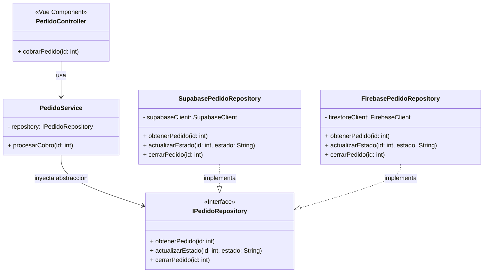
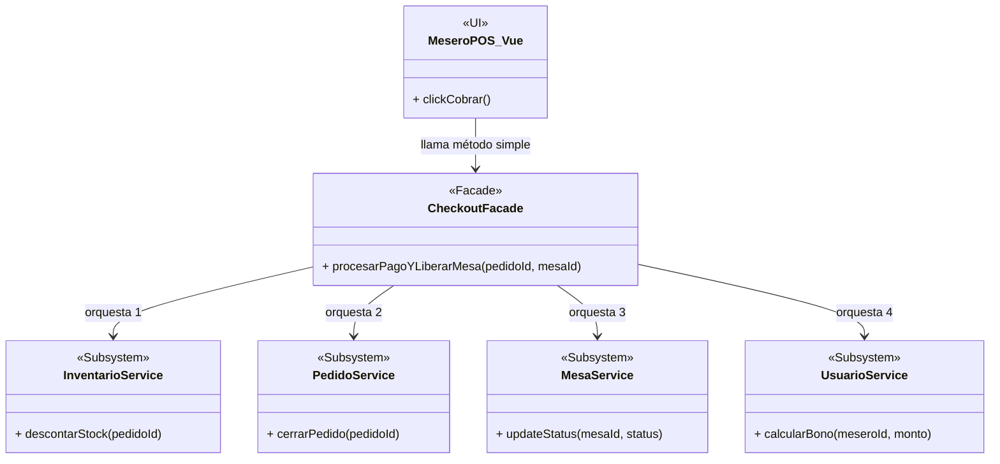

# Análisis de Arquitectura: Mejores Prácticas, Principios SOLID y Patrones de Diseño

El presente documento analiza la estructura actual del proyecto **AromaGrano System** (desarrollado con Vue 3, Vite y Supabase) y propone la implementación de mejores prácticas, principios SOLID y Patrones de Diseño de Software para escalar, mantener y probar la aplicación con mayor facilidad.

---

## 1. Identificación de Oportunidades de Mejora

Actualmente, el sistema funciona de manera eficiente y utiliza tecnologías modernas. Sin embargo, al inspeccionar componentes complejos como `MeseroPOS.vue` o `AdminDashboard.vue`, se identifican las siguientes áreas de oportunidad:

1. **Alta mezcla de responsabilidades en la UI:** Los componentes de Vue están manejando la presentación (HTML/CSS), el estado global, la lógica de negocio (cálculo de metas, bonos) y las peticiones directas a la base de datos (servicios).
2. **Fuerte acoplamiento con la infraestructura (BaaS):** Los servicios (ej. `pedidos.service.js`) importan directamente el cliente de `Supabase` y ejecutan consultas SQL-like. Si en el futuro se desea cambiar la base de datos o hacer pruebas unitarias, el esfuerzo de refactorización sería masivo.
3. **Orquestación compleja en la vista:** Procesos como "Cobrar un Pedido" requieren múltiples pasos (descontar inventario, cerrar pedido, calcular meta del mesero, liberar mesa). Actualmente el componente de UI orquesta todos estos pasos manualmente.

---

## 2. Propuesta de Principios SOLID a Implementar

### A. Principio de Responsabilidad Única (SRP - Single Responsibility Principle)
**Problema actual:** `MeseroPOS.vue` gestiona la lógica del carrito de compras, el cálculo de métricas MADI (Happy Hour) y la suscripción a WebSockets.
**Propuesta:** Extraer la lógica del negocio hacia **Composables** de Vue (ej. `useCart()`, `useCheckout()`) o **Stores de Pinia**. El componente `.vue` debe limitarse únicamente a reaccionar a los eventos del usuario (clics) y renderizar variables.

### B. Principio de Inversión de Dependencias (DIP - Dependency Inversion Principle)
**Problema actual:** La lógica de la aplicación depende de implementaciones concretas (Supabase).
**Propuesta:** Los componentes deben depender de abstracciones (interfaces), no de detalles. Se debe inyectar un servicio genérico de "Base de Datos" en lugar de importar Supabase directamente en cada archivo.

---

## 3. Patrones de Diseño Propuestos

Para materializar los principios SOLID mencionados, proponemos implementar los siguientes **Patrones de Diseño Estructurales y de Comportamiento**.

### 3.1. Patrón Repository (Repositorio) + Adapter (Adaptador)
**Justificación:** Al aplicar el Patrón Repositorio, creamos una capa de abstracción entre la lógica de negocio y la fuente de datos (Supabase). Esto cumple con el Principio de Inversión de Dependencias (DIP). Si mañana el negocio decide migrar de Supabase a un backend propio en Node.js o Firebase, solo se debe crear un nuevo "Adaptador" que cumpla con el contrato del Repositorio, sin tocar ni una sola línea de código en las pantallas de Vue.

#### Diseño UML (Patrón Repository)

---

### 3.2. Patrón Facade (Fachada)
**Justificación:** Procesos transaccionales como "Cerrar Pedido" requieren comunicarse con el Servicio de Pedidos, el Servicio de Inventario, el Servicio de Mesas y el Servicio de Usuarios (para el bono). Exponer esta complejidad al componente de Vue rompe el principio de Responsabilidad Única (SRP). 
Una **Fachada (Facade)** proporcionará una única función unificada (`checkoutFacade.procesarPago()`) que internamente orquestará todos los subsistemas. El frontend solo llamará a la fachada y recibirá un éxito o un error.

#### Diseño UML (Patrón Facade)

---

### 3.3. Patrón Observer (Observador) a través de Event Bus / Pinia
**Justificación:** Supabase Realtime utiliza nativamente el patrón Observer. Sin embargo, en el código actual los componentes montan y desmontan las escuchas. Se propone centralizar las suscripciones WebSocket en un Store de Pinia (`useRealtimeStore`). El Store actuará como el "Sujeto Observado" y los múltiples componentes de la aplicación actuarán como "Observadores" que reaccionan automáticamente a los cambios de estado reactivo, centralizando la lógica de reconexión y evitando fugas de memoria.

## 4. Conclusión

La implementación de los patrones **Repository**, **Facade** y **Observer** alineará el proyecto AromaGrano System con los principios SOLID (particularmente SRP y DIP). Esto convertirá la aplicación en un sistema de clase empresarial, en el cual:
1. La Interfaz de Usuario (Vue) sea "tonta" y solo se dedique a pintar datos (Separación de intereses).
2. Las pruebas unitarias (*Unit Testing*) puedan realizarse con *mocks* de los repositorios sin requerir conexión a internet.
3. El mantenimiento y evolución del sistema sean ágiles y seguros ante la rotación de desarrolladores.
